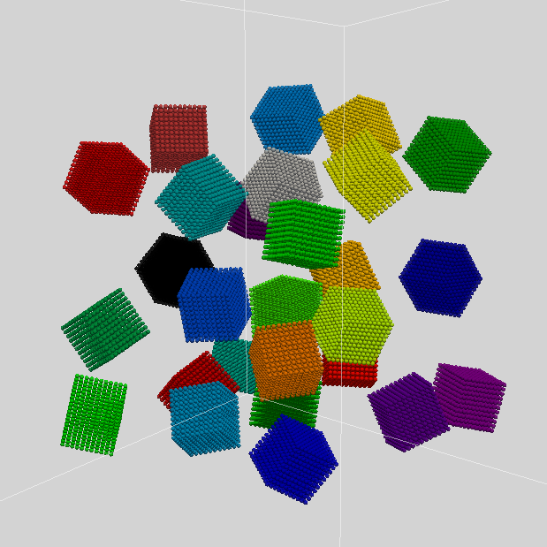

# MPM pytorch

pytorch version of https://github.com/yuanming-hu/taichi_mpm

Cédric Allier

Janelia Research Campus, Howard Hughes Medical Institute

python -o generate 'multimaterial_4_0'


python -o generate 'multimaterial_4_0'


### Setup
Run the following line from the terminal to create a new environment particle-graph:
```
conda env create -f environment.yaml
```

Activate the environment:
```
conda activate MPM-pytorch
```

Install the package by executing the following command from the root of this directory:
```
pip install -e .
```

Then, you should be able to import all the modules from the package in python:

```python
from MPM-pytorch import *
```
